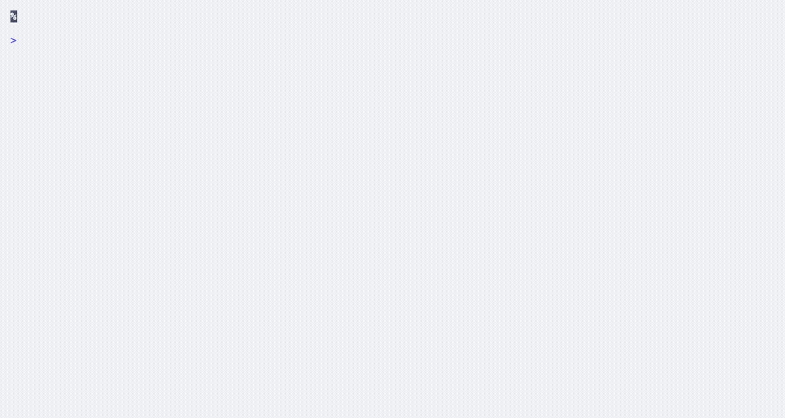
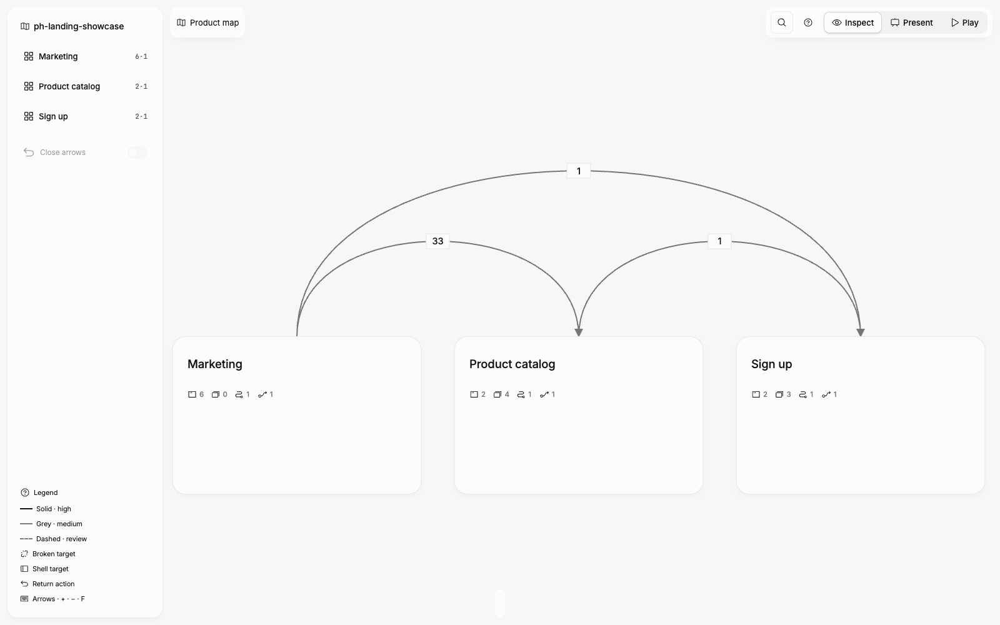
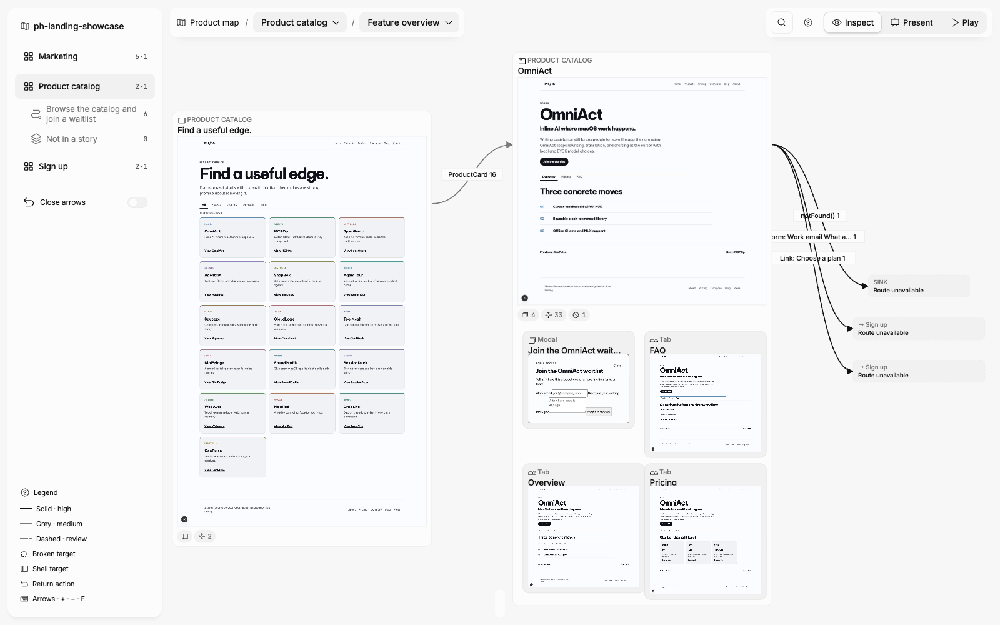
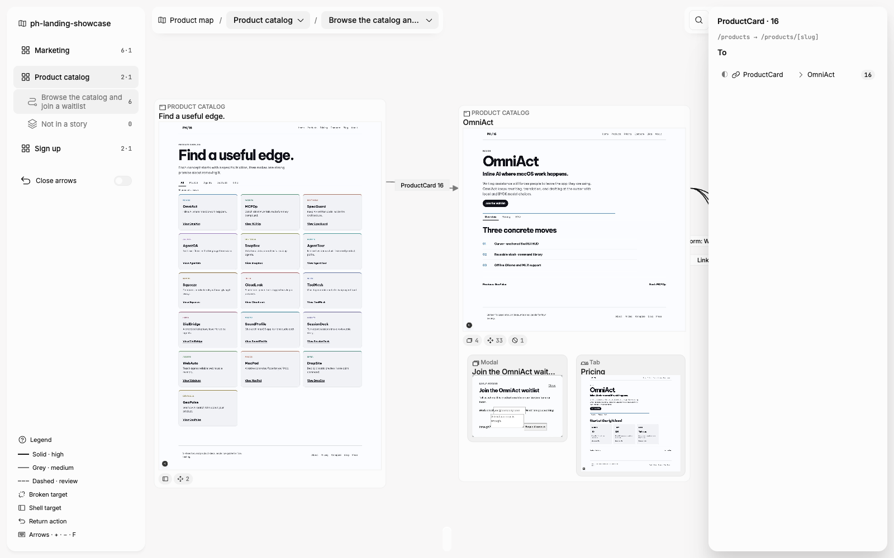
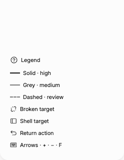
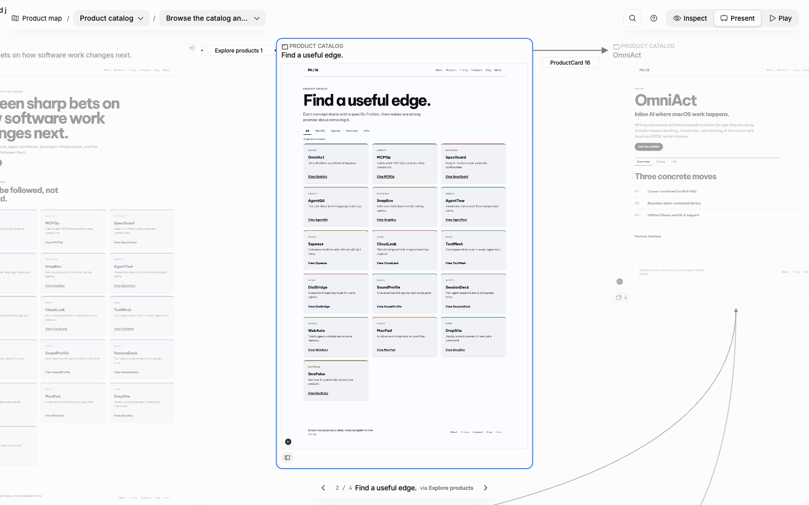
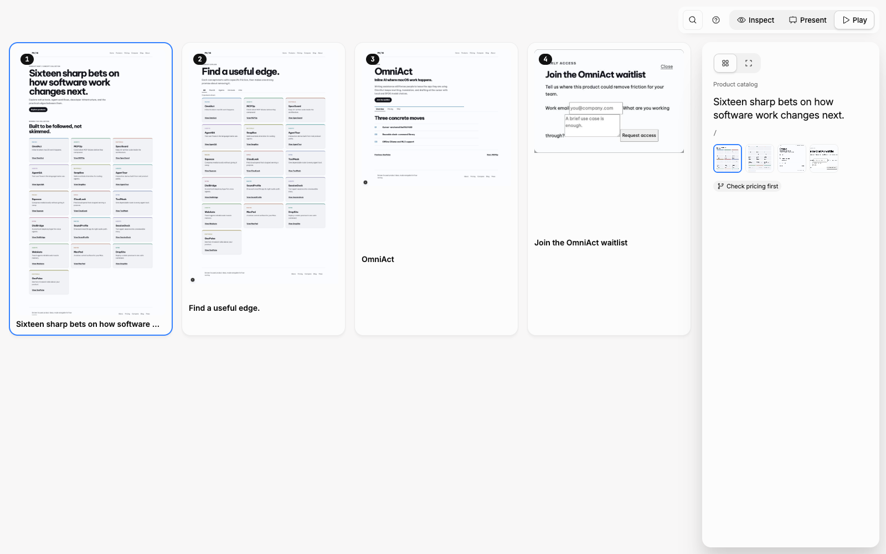
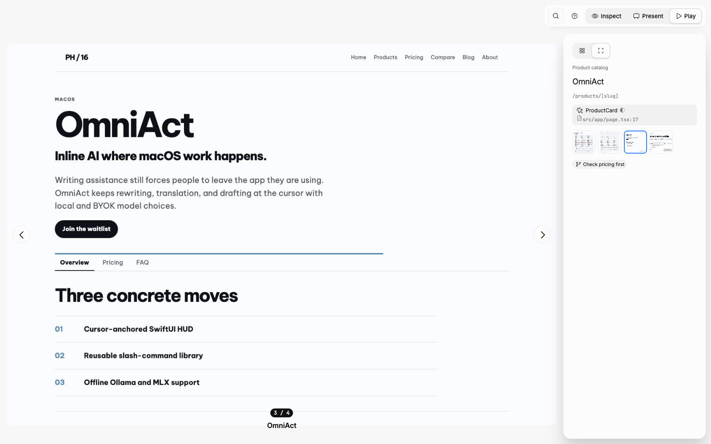
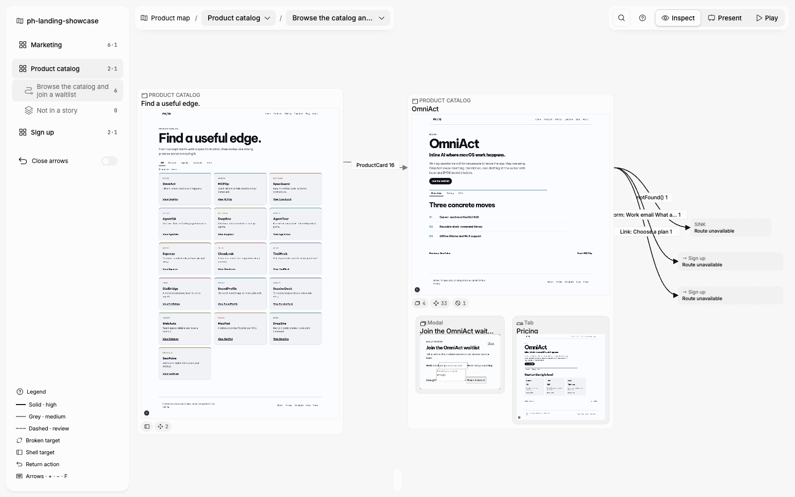

# Code2Flow user guide

Code2Flow turns your web app's code into a local **Flow Canvas** of Route Screens, State Screens, and User Flow Edges. Nothing from the app, its graph, or its captures is uploaded.

Use `/path/to/your-app` below as the folder containing the app you want to map.

## 0. Check the requirements

You need Node.js 20 or newer, Google Chrome, and a development server command for the app. Code2Flow uses Chrome locally to capture the app; it starts the configured command itself for `run` unless you give it an already-running URL.

What you see: Node reports a version beginning with `v20` or later, and Chrome is installed.

If it fails: install Node 20+ and Google Chrome, then make sure the app starts locally with its usual development command before continuing.

## 1. Install Code2Flow

```bash
npm i -g design-os-code2flow
code2flow
```

What you see: a list of `scan`, `init`, `run`, `paths`, `snapshot`, `login`, `serve`, `export`, `render`, `stories`, `lint`, and `diff`.

If it fails: confirm that `npm` is on your PATH and rerun after installing Node 20+.

## 2. Set up the app folder

```bash
code2flow init /path/to/your-app
```

What you see: Code2Flow creates or keeps `code2flow.config.json`, adds `.code2flow/` to `.gitignore`, adds a Code2Flow section to `AGENTS.md` or `CLAUDE.md`, and copies the three agent skills unless you choose `--no-skills`. The config records the app's local server URL; the viewer itself always uses `127.0.0.1:4317`.

If it fails: check that the path is the app root and that you can write there. Rerunning `init` is safe.

## 3. Create the first Flow Canvas

```bash
code2flow run /path/to/your-app
```

What you see: one summary line with Screen Nodes, User Flow Edges, captures, failed captures, and lint errors. The command scans, captures, validates a Story Manifest when present, lints, writes an offline export, and stops the server it started. It also writes `.code2flow/run-summary.json`.



*Caption: A successful run prints the scan and capture summary before the offline export is ready.*

Exit codes:

| Code | Meaning | What to do |
| --- | --- | --- |
| `0` | The run completed with no lint errors. | Open the export or start the viewer. |
| `1` | The run completed, but lint found a broken link. | Run `code2flow lint /path/to/your-app` and fix or review the listed link. |
| `2` | The run did not start or finish. | Read the one-line error; common causes are no `serverUrl`, a busy configured port, a failed dev server, or a malformed Story Manifest. |

If your app is already running, use its exact URL instead of starting another server:

```bash
code2flow run /path/to/your-app --url http://127.0.0.1:3000
```

If it fails: do not choose another port automatically. Start the app at the configured URL, or update `serverUrl` and `devCommand` in [the configuration reference](config-reference.md).

## 4. Explore the viewer

```bash
code2flow serve /path/to/your-app
```

What you see: a local viewer at `http://127.0.0.1:4317`. Leave this terminal running while you explore; press `Ctrl+C` when you are done.

If it fails: run `code2flow run /path/to/your-app` or `code2flow scan /path/to/your-app` first so `.code2flow/graph.json` exists. If port 4317 is in use, stop the process using it; Code2Flow does not select a different viewer port.

### Start at the product map

The product map groups Route Screens by feature. Click a feature card to open its feature page.



*Caption: The product map is the shortest way to choose a feature before inspecting its screens.*

### Inspect a feature

Use **Inspect** for the feature canvas. Click a Screen Node to open the Inspector panel with its route, screenshot, State Screen count, and incoming/outgoing evidence. Click an edge pill to inspect the associated User Flow Edge.



*Caption: Inspect shows the feature canvas; selecting a Screen Node opens the Inspector panel.*



*Caption: An edge pill opens its transition details and source evidence.*

The left rail lists features and keeps the legend pinned at its bottom. Hover every canvas icon for its tooltip. Frame titles use real screen titles, not route slugs; the route is available in the Inspector.



*Caption: The rail keeps feature navigation above the transition legend.*

### Present a story

Choose **Present** to show one canvas lane at a time. Both sidebars are hidden so the story has the full canvas. Use this for a clean walkthrough; `Escape` returns to Inspect.



*Caption: Present mode removes the rails and leaves one story lane on the canvas.*

### Play every step

Choose **Play** to see a grid of every step in the selected story. Click a card to open Focus view: one step at a time with prev/next arrows, a `3 / 4` chip and the Play panel evidence beside it. Arrow keys move between steps in both views; `Escape` returns from Focus to the grid. The two buttons at the top of the Play panel switch views.



*Caption: Play mode puts every story step in a selectable capture gallery.*



*Caption: Focus view shows one step with its evidence; click a grid card to enter it.*

### Read State Screens and zoom

Modals, dropdowns, tooltips, and drawers appear as tinted State Screens under their Route Screen. Hover-opened overlays can be captured when the trigger has a literal `data-testid` or `id`; see [Hover states](adapters.md#hover-states).



*Caption: Tinted frames distinguish State Screens from Route Screens.*

Use the mouse wheel or pinch gesture to zoom, and drag to pan. The canvas deliberately shows less detail at far zoom levels so the map stays readable.

| Key | Action |
| --- | --- |
| `⌘K` or `Ctrl+K` | Find a screen or story. |
| `/` | Open the same finder. |
| `+` / `-` | Zoom in / out. |
| `F` | Fit the canvas. |
| `[` / `]` | Previous / next story. |
| Arrow keys or `Page Up` / `Page Down` | Previous / next step in Present or Play. |
| `P` | Open Present. |
| `Escape` | Close the current panel or return one level. |

If a control is unclear: hover its icon for a tooltip, or use the help button on the canvas for the transition legend and shortcut reminder.

## 5. Turn a PRD into story lanes with a coding agent

First create a graph, then scaffold a prompt pack from your PRD:

```bash
code2flow stories scaffold /path/to/your-app docs/prd/checkout.md
```

What you see: `.code2flow/stories-prompt.md`, containing the PRD text, allowed Screen Node ids, and the Story Manifest shape.

If it fails: run `code2flow scan /path/to/your-app` first, and give the full path to the PRD file.

Give the generated prompt pack to your coding agent with the installed `code2flow-stories-from-prd` skill. The agent writes `code2flow.stories.json`; then validate its claims against the graph:

```bash
code2flow stories validate /path/to/your-app
```

What you see: unknown Screen Nodes and PRD transitions not detected in code. These are drift signals to review, not details Code2Flow silently removes.

If it fails: fix malformed JSON or the reported manifest structure, then validate again.

## 6. Ask path questions

```bash
code2flow paths /path/to/your-app --from / --to "/docs/[...parts]"
code2flow paths /path/to/your-app --orphans
code2flow paths /path/to/your-app --dead-ends
```

What you see: the shortest source-evidenced path, or screens that nothing reaches / that lead nowhere. Each path hop includes its Action Trigger, Transition Confidence, and `file:line` evidence.

If it fails: copy the exact Screen Node id from the graph or viewer. Use `--shell` when the start screen is reached only through shell navigation. See the `code2flow-answer-flow-questions` skill for agent-friendly question routing.

## 7. Make hand-outs

```bash
code2flow export /path/to/your-app
code2flow render /path/to/your-app --png --pdf
```

What you see: `export` writes a self-contained HTML file that opens offline. `render` writes PNGs for the product map, features, and stories plus a PDF hand-out.

If it fails: run `code2flow run /path/to/your-app` first. Use `--feature`, `--story`, `--out`, or `--scale` to narrow a render. When a whole-app export would exceed 14 MB, Code2Flow splits screenshots into one HTML file per feature; each file still carries the full graph.

## 8. Sign in for an app behind authentication

Put the test account in environment variables (never in the repo) and tell Code2Flow their names in `code2flow.config.json`:

```json
{ "login": { "path": "/login", "emailEnv": "MYAPP_EMAIL", "passwordEnv": "MYAPP_PASSWORD", "successUrl": "/dashboard" } }
```

```bash
export MYAPP_EMAIL="…" MYAPP_PASSWORD="…"
code2flow run /path/to/your-app          # signs in headless before capturing; summary shows `login: ok`
code2flow login /path/to/your-app --url http://127.0.0.1:3000   # the same sign-in on its own
```

What you see: `login: ok` in the run summary and `.code2flow/storage-state.json` saved; later runs reuse it (`--relogin` forces a new sign-in). Code2Flow finds the email field, the password field and the submit button itself; set `login.selectors` when the form is unusual. Values are read from the environment at run time and are never written to the config, the graph, the export or the logs.

If it fails: the one-line message names the missing variable (`login: missing MYAPP_EMAIL`) or the selector that did not match. Without credentials the run continues and reports `login: skipped (no MYAPP_EMAIL)`; captures of protected pages then show the sign-in page. For Google/SSO-only apps use `code2flow login … --manual`: a Chrome window opens, sign in by hand, press Enter, and the session is saved the same way.

## 9. Work with Claude Code or Codex

`init` adds a Code2Flow section to `AGENTS.md` or `CLAUDE.md` and installs three skills in `.claude/skills/`:

- `code2flow-map-codebase` — initialize, run, and report a Flow Canvas.
- `code2flow-answer-flow-questions` — answer reachability and evidence questions from `.code2flow/graph.json`.
- `code2flow-stories-from-prd` — turn a PRD into a validated Story Manifest.

Example prompt for either agent:

```text
Use code2flow-map-codebase to map /path/to/your-app. Run the local scan and capture, report Screen Nodes, User Flow Edges by Transition Confidence, capture gaps, lint findings, and the offline export path. Do not change the target app's source.
```

If the agent cannot find the skill: copy the package's `.claude/skills/` directory into the target repo, or rerun `code2flow init /path/to/your-app` without `--no-skills`.

## 10. Troubleshooting

| Problem | What it means | Next action |
| --- | --- | --- |
| Port already in use | `run` found something on the configured app port, or `serve` cannot claim 4317. | Stop the conflicting process; do not switch ports automatically. |
| No adapter detected | The target does not match a shipped Next.js App Router, React Router, or static HTML adapter. | Check [adapters](adapters.md) and run the tool from the app root. |
| Screenshots missing | A capture failed, has no URL, is login-gated, or was clipped at the cap. | Read `.code2flow/run-summary.json` and lint output; use `login` or fix the app server. |
| Dynamic route without a sample | Code2Flow knows `/products/[slug]` but not a concrete product URL. | Add a full URL to `routeExamples` in `code2flow.config.json`. |
| Export split around 14 MB | One offline HTML would be too large to share comfortably. | Send the per-feature HTML files; each opens offline and retains the whole graph. |

For configuration details, read the [configuration reference](config-reference.md). For capture and Transition Confidence rules, read [confidence and capture](confidence-and-capture.md).
